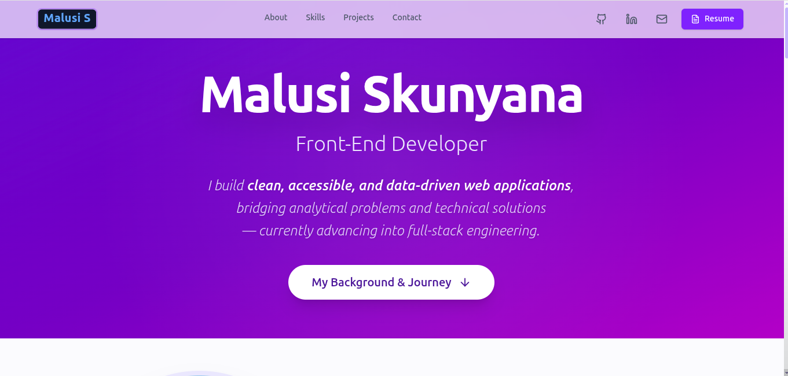

# 🌐 Malusi Skunyana — Portfolio Website

[](https://malusis.tech/)

A production-ready Front-End Developer portfolio built with React, Vite, and Tailwind CSS — engineered with accessibility, performance, and refined UI in mind.


## 🖼 Preview



## 🚀 Tech Stack

- **Framework:** React 18 (Functional Components, Hooks)
- **Build Tool:** Vite (Fast HMR & optimized production builds)
- **Styling:** Tailwind CSS (Utility-first, responsive design)
- **Animations:** `tailwindcss-animate` (Smooth scroll reveals)
- **Icons:** Lucide React
- **Forms:** Formspree API (Serverless form handling)
- **Deployment:** Netlify (Continuous Deployment with custom domain configuration)

## 🧠 Key Architectural Decisions

This portfolio was built with "Senior Developer" best practices in mind:
- **Config-Driven Data:** All project narratives, tech stacks, and URLs are isolated in a centralized `src/assets/config.js` file, keeping React components strictly focused on the UI layer.
- **Accessibility First (A11y):** Implemented semantic HTML (`<article>`, `<nav>`, `<aside>`), robust ARIA labels, focus-trapping for modals, and `prefers-reduced-motion` support for users with vestibular disorders.
- **Defensive UI:** Graceful fallbacks for mobile browsers (e.g., native PDF handling for iOS Safari instead of broken iframes) and programmatic scrolling.
- **Performance Optimized:** Component unmounting for hidden sections, `requestAnimationFrame` for smooth interactions, and optimized asset loading.

## ✨ Features

- **🌟 Hero Section:** Clean introduction with prominent CTAs and modern typography.
- **📌 Featured Projects:** Premium grid display featuring custom modals, live demos, and GitHub source links.
- **📁 Other Projects:** A progressive-disclosure layout (Load More / Show Less) for smaller demos, maximizing performance and UX.
- **🧠 Technical Toolkit:** "Tag Cloud" skill presentation showcasing expertise in Front-End, Back-End, and DevOps methodologies.
- **💬 Contact Integration:** Fully functioning, validated contact form wired to Formspree with accessible success states.

## 🛠️ Local Development

To run this project locally on your machine:

1. **Clone the repository:**
   ```bash
   git clone https://github.com/MalusiS/malusi-skunyana.git
   cd malusi-skunyana

2. **Install dependencies:**
   ```bash
   npm install

3. **Start the development server:**
   ```bash
   npm run dev

4. **Open in browser:**
   Navigate to http://localhost:5173

## 🎨 Favicon & Branding

The site features a custom SVG logo and a fully compliant PWA manifest/favicon set (16x16 up to 512x512) loaded natively via index.html.

## 📜 License

This portfolio's codebase and design are personal and proprietary. You may not copy the design or text without explicit permission.

## 👨🏾‍💻 Author

**Malusi Skunyana** 
Front-End Developer • UI builder • JavaScript Enthusiast

- **GitHub:** https://github.com/MalusiS

- **LinkedIn:** https://linkedin.com/in/malusis

- **Email:** malusiskunyana@gmail.com
