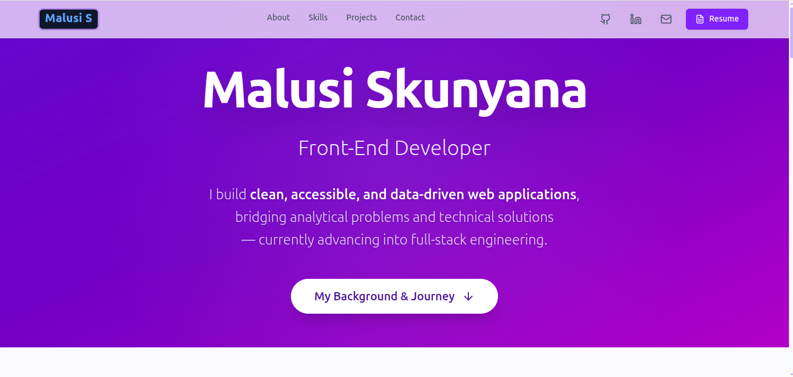

# 🌐 Malusi Skunyana — Portfolio Website

[](https://malusis.tech/)
[](https://malusis.tech/)

A production-ready Front-End Developer portfolio built with React, Vite, and Tailwind CSS — engineered with strict accessibility standards, technical SEO, and a refined "Endless Canvas" UI architecture.

## 🖼 Preview



## 🚀 Tech Stack

- **Framework:** React 18 (Functional Components, Hooks)
- **Build Tool:** Vite (Fast HMR & optimized production builds)
- **Styling:** Tailwind CSS (Utility-first, responsive design, fluid typography)
- **Animations:** `tailwindcss-animate` (Smooth scroll reveals, reduced-motion compliant)
- **Icons:** Lucide React
- **Forms:** Formspree API (Serverless form handling)
- **Deployment:** Netlify (Continuous Deployment with custom domain configuration)

## 🧠 Key Architectural Decisions

This portfolio was engineered to demonstrate "Senior-level" front-end best practices:

- **Elite Accessibility (100/100 Lighthouse):** Achieved perfect accessibility scores by enforcing strict WCAG AA 4.5:1 color contrast ratios, implementing semantic HTML (`<article>`, `<nav>`, `<aside>`), and utilizing `focus-visible` states to preserve aesthetic integrity while ensuring flawless keyboard navigation.
- **Technical SEO & Metadata:** Configured complete OpenGraph tags, dynamic mobile `theme-color`, and injected JSON-LD Structured Data (Schema.org) to establish clear entity relationships for search engines.
- **Flawless Responsive Layouts:** Solved classic mobile viewport bugs by utilizing dynamic `svh` (Small Viewport Height) units for the Hero section, and decoupled Y-axis padding to eliminate "Anchor Gap" scroll alignment issues across all devices.
- **Config-Driven Architecture:** All project narratives, tech stacks, and URLs are isolated in a centralized `src/assets/config.js` file, keeping React components strictly focused on the UI presentation layer.
- **Modern UI/UX Patterns:** Transitioned from dated block-backgrounds to a modern "Endless Canvas" aesthetic using pure white backgrounds, subtle `gray-100` hairline borders, and calculated drop-shadows to establish a premium visual hierarchy.

## ✨ Features

- **🌟 Hero Section:** Immersive introduction utilizing dynamic viewport height scaling and modern, text-balanced typography.
- **📌 Featured Projects:** Premium grid display featuring custom modals, live demos, and GitHub source links.
- **📁 Other Projects:** A progressive-disclosure layout (Load More / Show Less) for smaller demos, maximizing DOM performance and UX.
- **🧠 Technical Toolkit:** "Tag Cloud" skill presentation showcasing expertise in Front-End, Back-End, and DevOps methodologies.
- **💬 Contact Integration:** Fully functioning, validated contact form wired to Formspree with accessible success states.

## 🛠️ Local Development

To run this project locally on your machine:

1. **Clone the repository:**
   ```bash
   git clone [https://github.com/MalusiS/malusi-skunyana.git](https://github.com/MalusiS/malusi-skunyana.git)
   cd malusi-skunyana

2. **Install dependencies:**
   ```bash
   npm install

3. **Start the development server:**
   ```bash
   npm run dev

4. **Open in browser:**
   Navigate to http://localhost:5173

## 🎨 Favicon & Branding

The site features a custom SVG logo and a fully compliant PWA manifest/favicon set (16x16 up to 512x512) loaded natively via `index.html`.

## 📜 License

This portfolio's codebase and design are personal and proprietary. You may not copy the design or text without explicit permission.

## 👨🏾‍💻 Author

**Malusi Skunyana**
Front End Developer | Data Visualization | Back-End Technologies | Aspiring Full Stack Dev

- **GitHub:** https://github.com/MalusiS

- **LinkedIn:** https://linkedin.com/in/malusis

- **Website:** https://malusis.tech
