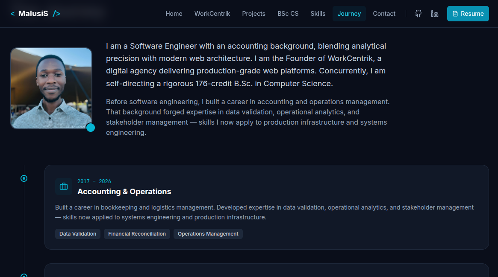

# 🌐 Malusi Skunyana — Engineering Portfolio

[](https://malusis.tech/)
[](https://malusis.tech/)

A production-grade engineering portfolio showcasing commercial software development, client projects, and a rigorous self-directed Computer Science programme focused on Systems & Software Engineering. Built with React 19, Vite 7, and Tailwind CSS v4 — engineered with strict accessibility standards (WCAG AA), technical SEO, and a dark "Systems Engineering" UI architecture.

## 🖼 Preview



## 🚀 Tech Stack

- **Framework:** React 19 (Functional Components, Hooks, Suspense)
- **Build Tool:** Vite 7 (Fast HMR & optimized production builds)
- **Styling:** Tailwind CSS v4 (Utility-first, dark theme, responsive design)
- **Animations:** `tailwindcss-animate` (Smooth scroll reveals, reduced-motion compliant)
- **Icons:** Lucide React
- **Forms:** Formspree API (Serverless form handling)
- **Deployment:** Netlify (Continuous Deployment with custom domain configuration)

## 🧠 Key Architectural Decisions

This portfolio was engineered to demonstrate senior-level front-end best practices while serving as public evidence of a rigorous self-directed B.Sc. CS curriculum:

- **Elite Accessibility (100/100 Lighthouse):** Perfect accessibility scores across all categories via strict WCAG AA 4.5:1 color contrast ratios, semantic HTML (`&lt;article&gt;`, `&lt;nav&gt;`, `&lt;section&gt;`), and `focus-visible` states for flawless keyboard navigation.
- **Technical SEO & Metadata:** Complete OpenGraph tags, JSON-LD Structured Data (Schema.org Person + Organization), dynamic `theme-color`, and canonical URLs for search engine entity recognition.
- **Scroll Spy Navigation:** Custom IntersectionObserver implementation with smooth scroll and active section highlighting, eliminating anchor-gap alignment issues across all viewports.
- **Config-Driven Architecture:** All project narratives, curriculum data, skills matrices, and URLs are isolated in `src/assets/config.js`. React components handle presentation only.
- **Tiered Project Hierarchy:** Agency work (commercial clients) → Featured projects (technical depth) → Archive (learning history). Prevents dilution of production credibility.
- **Lazy-Loaded Modals:** Project detail modals and resume viewer are code-split via React.lazy + Suspense, keeping initial bundle size minimal.
- **Dark Systems Aesthetic:** Deep navy (`slate-950`) background with cyan (`cyan-500`) accents — signaling infrastructure, distributed systems, and engineering rigor rather than generic "tech blue."

## ✨ Features

- **🌟 Hero Section:** Hero Section: Immersive introduction with dynamic viewport scaling, trajectory statement ('Front-End Engineer → Systems & Software Engineer'), 176-credit program badge, and dual CTAs.
- **🏢 WorkCentrik Agency Showcase:** Production-grade client projects (WorkCentrik Corporate Hub, AMO South Africa) with Lighthouse score badges, client context, and live demo links.
- **📌 Featured Projects:** Technical depth pieces (HR Management Portal, Engineering Portfolio, Shared Bookmarks Manager, Temporal Logic Calendar Engine) with narrative-driven modals.
- **📁 Project Archive:** Progressive-disclosure grid for 17 learning exercises. Expands in-place below Featured Projects via toggle to preserve narrative hierarchy.
- **🎓 BSc CS Curriculum Tracker:** Live academic progress dashboard showing 176-credit, 5-year program status (2026–2031), Year 1 course grid, closed-book exam system with self-grading rubric, Engineering Metrics Dashboard integration, and capstone preview (Multi-Tenant Agency Infrastructure).
- **📊 Skills Matrix:** Two-tier visualization separating Production Engineering (React, TypeScript, Accessibility, CI/CD) from Systems & Mathematics (C, Java, Distributed Systems, Database Internals).
- **🧭 The Journey:** Timeline section documenting the Accounting → Front-End → Systems Engineering trajectory with professional photo and phase-based skill tags.
- **💬 Contact & Evidence Hub:** Formspree-integrated contact form alongside direct links to GitHub, LinkedIn, Curriculum Repository, Academic Transcript, and Technical Blog.
- **📄 Resume Modal:** In-browser PDF viewer with download capability, accessible via header CTA and About section.

## 🛠️ Local Development

To run this project locally:

1. **Clone the repository:**
   ```bash
   git clone https://github.com/MalusiS/malusi-skunyana.git
   cd malusi-skunyana

2. **Install dependencies:**
   ```bash
   npm install

3. **Start the development server:**
   ```bash
   npm run dev

4. **Open in browser:**
   Navigate to `http://localhost:5173`

## 🎨 Favicon & Branding

The site features a custom SVG logo, fully compliant PWA manifest/favicon set (16×16 up to 512×512), and a LinkedIn-optimized banner image. All assets are loaded natively via `index.html`.

## 📜 License

This portfolio's codebase and design are personal and proprietary. You may not copy the design or text without explicit permission.

## 👨🏾‍💻 Author

**Malusi Skunyana**

Software Engineer | Founder, WorkCentrik

Self-Directed B.Sc. CS (Systems & Software Engineer)

- Portfolio: malusis.tech
- GitHub: github.com/MalusiS
- LinkedIn: linkedin.com/in/malusis
- Curriculum: github.com/MalusiS/bsc-cs-curriculum
